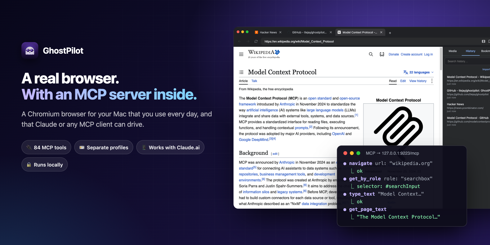
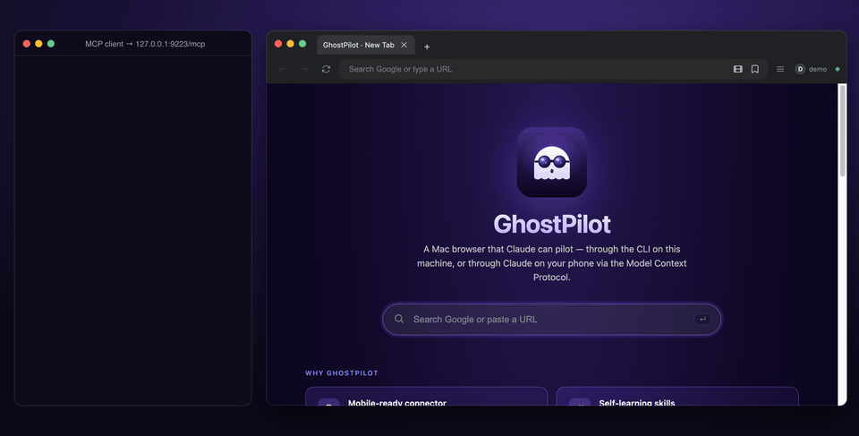
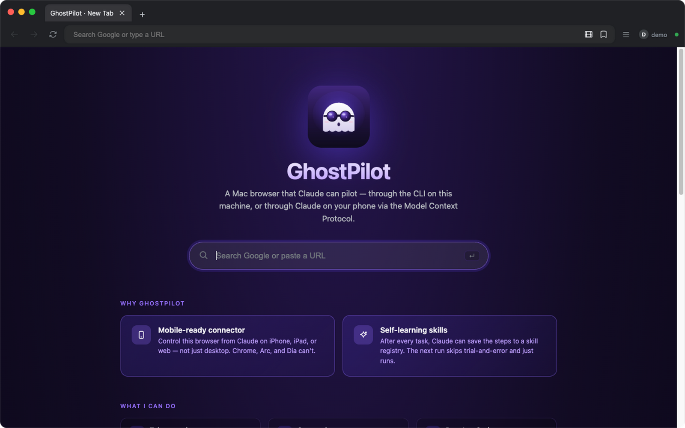
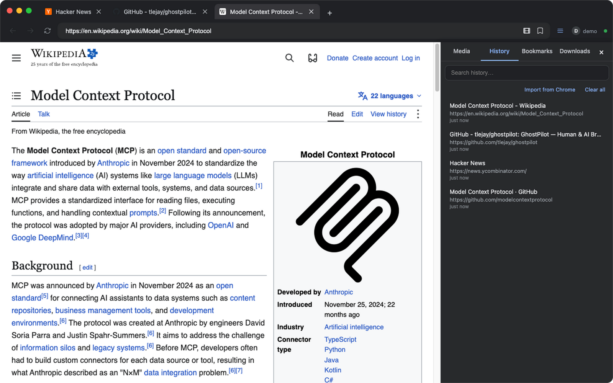

<div align="center">



# 👻 GhostPilot

**A Chromium browser for your Mac that you use every day, and that Claude can drive.**

GhostPilot runs an MCP server inside the browser. Claude Code, Claude.ai or any other
[Model Context Protocol](https://modelcontextprotocol.io) client can then open tabs, click, type, read pages, capture network traffic and more, all in the same window you browse in.

[](./LICENSE)
[](https://www.electronjs.org/)
[](https://www.typescriptlang.org/)
[](#-tool-surface-84)
[](#build-a-dmg)
[](https://github.com/tlejay/ghostpilot/stargazers)

[**Quick start**](#-quick-start) · [**See it in action**](#-see-it-in-action) · [**Tools**](#-tool-surface-84) · [**Connect from Claude.ai**](#connect-from-claudeai-web--iphone--ipad) · [**Configuration**](#configuration)

</div>

---

## ✨ What you get

| Feature | What it does |
|---|---|
| 🧭 **A real browser** | Chromium via Electron 33, with tabs, bookmarks, history, downloads, find-in-page and a side panel. You can use it as your everyday browser. |
| 🔌 **84 MCP tools** | Navigate, click, fill, type, hover, screenshot, evaluate JS, read the accessibility tree, emulate devices, run Lighthouse, or send raw CDP. |
| 🎯 **Playwright-style locators** | `get_by_role`, `get_by_text`, `get_by_label` and `get_by_test_id` return a stable CSS selector. `click` and `fill` wait for the element and retry when the DOM changes. |
| 🌐 **Network capture + HAR** | Filter requests by method, status, URL pattern, MIME type or time, then export them as HAR 1.2. |
| 🪪 **Separate profiles** | Each profile has its own cookies, storage, history and bookmarks. Switch from the toolbar or over MCP. |
| 📱 **Drive it from Claude.ai** | Optional OAuth 2.1 + PKCE with dynamic client registration. Put a tunnel in front and Claude on iPhone or the web can control the browser on your Mac. |
| 👻 **Headless mode** | `--headless` hides the window and Dock icon. The MCP server works the same, so you can run it on CI. |
| 🧰 **External Chrome too** | The `ext_*` tools drive any Chrome started with `--remote-debugging-port`, so you can reuse a session you're already signed in to. |
| 🧠 **Skills registry** | Claude can save the steps of a task it has worked out (`save_skill`) and reuse them next time (`get_skill`). |
| 🔒 **Local by default** | The MCP server binds to `127.0.0.1`. There's no telemetry. The only network calls GhostPilot makes on its own are update checks against GitHub Releases. |

## 🎬 See it in action

<div align="center">

</div>

On the left, an MCP client calls tools over `http://127.0.0.1:9223/mcp`. On the right, GhostPilot does the work. Every step in the recording is a real tool call against the running app: `navigate` → `get_by_role` → `click` → `type_text` → `click` → `wait_for_text` → `get_page_text`.

## 🖥️ A browser first

<table>
<tr>
<td width="50%"></td>
<td width="50%"></td>
</tr>
<tr>
<td align="center"><sub><b>New tab page.</b> Search Google or paste a URL.</sub></td>
<td align="center"><sub><b>Side panel</b> (<kbd>⌘B</kbd>) with history, bookmarks, downloads and media.</sub></td>
</tr>
</table>

The green dot next to the profile badge shows the MCP server is up. Screenshots are taken from a fresh `demo` profile. More: [tabs](docs/tabs.png).

## 🤔 GhostPilot or another browser MCP?

There are good options already. This is how they differ, as fairly as we can put it:

| What matters | GhostPilot | Playwright MCP / chrome-devtools-mcp | Claude in Chrome (extension) |
|---|---|---|---|
| Browser | Its own Chromium app (Electron) | Launches or attaches to Chrome | Your existing Chrome |
| You browse in it too | Yes, it's designed as a daily browser | Usually a separate automation window | Yes |
| Reach it from Claude.ai on a phone | Yes, via OAuth + your own tunnel | Not built in | Runs inside desktop Chrome |
| Setup | Build or install an app, add one MCP URL | `npx` one package | Install an extension |
| Platform | **macOS only** | Cross-platform | Wherever Chrome runs |
| Maturity | One maintainer, young project | Backed by large teams | Official Anthropic product |

**Pick another tool** if you need Windows or Linux, or cross-browser testing (Firefox, WebKit), or if you'd rather not install a separate browser. **Pick GhostPilot** if you want the AI to drive the same browser you use every day, or want to reach it from Claude on your phone.

## 🚀 Quick start

> **Version note.** `main` is **v0.8.1** (see [CHANGELOG](./CHANGELOG.md)). The newest prebuilt DMG on [Releases](https://github.com/tlejay/ghostpilot/releases/latest) is still **v0.4.0**, so build from source to get the tools added since then (profiles, media, yt-dlp, mouse/keyboard input, `hide_facebook_chat`).

```bash
# 1. install
pnpm install

# 2. dev (or `pnpm dist` to build a DMG, then install GhostPilot.app)
pnpm dev
# → window opens, MCP server boots on http://127.0.0.1:9223/mcp

# 3. wire it into Claude Code
claude mcp add --transport http ghostpilot http://127.0.0.1:9223/mcp

# 4. trivial MCP call: list the open tabs
curl -s -X POST http://127.0.0.1:9223/mcp \
  -H 'Content-Type: application/json' \
  -H 'Accept: application/json, text/event-stream' \
  -d '{"jsonrpc":"2.0","id":1,"method":"tools/call","params":{"name":"list_tabs","arguments":{}}}'
```

The tool result is a JSON array of tabs (inside the usual MCP `content[0].text`):

```json
[{"id":"88eb…","url":"https://en.wikipedia.org/wiki/Model_Context_Protocol","title":"Model Context Protocol - Wikipedia","loading":false,
  "canGoBack":false,"canGoForward":false,"active":true,"pinned":false}]
```

5. Walk through a real end-to-end task in **[TUTORIAL.md](./TUTORIAL.md)** (capture a HAR of a Google search, extract the failed requests).

## 🧰 Tool surface (84)

> Need fewer tools for a small client context window? Filter at startup with `GHOSTPILOT_TOOLS=core` (or any comma-separated list of categories). See [Configuration](#configuration). `tool_categories` returns the live taxonomy.

| Group | Count | Tools |
|---|---|---|
| Tabs | 9 | `list_tabs`, `new_tab`, `close_tab`, `activate_tab`, `navigate`, `go_back`, `go_forward`, `reload`, `toggle_devtools` |
| Page | 7 | `get_page_text`, `get_page_html`, `screenshot`, `evaluate`, `click`, `fill`, `wait_for_selector` |
| Input | 10 | `press_key`, `type_text`, `hover`, `mouse_click`, `mouse_move`, `mouse_drag`, `keyboard_key`, `keyboard_type`, `scroll`, `get_viewport_info` (the mouse, keyboard and scroll tools send real CDP `Input.*` events) |
| Locators | 4 | `get_by_role`, `get_by_text`, `get_by_label`, `get_by_test_id`: Playwright-style stable selectors |
| Console | 2 | `list_console_messages`, `clear_console_messages` |
| Network | 3 | `list_network_requests` (rich filters), `clear_network_requests`, `export_har` (HAR 1.2) |
| Emulation | 3 | `emulate`, `clear_emulation`, `wait_for_text` |
| Accessibility | 1 | `a11y_snapshot` |
| Files / dialogs | 2 | `upload_file`, `handle_next_dialog` |
| Performance | 3 | `performance_start_trace`, `performance_stop_trace`, `lighthouse_audit` |
| CDP | 1 | `cdp_send`: raw Chrome DevTools Protocol passthrough |
| History | 2 | `history_list`, `history_clear` |
| Bookmarks | 3 | `bookmarks_list`, `bookmarks_add`, `bookmarks_remove` |
| Downloads | 4 | `downloads_list`, `downloads_cancel`, `downloads_reveal`, `downloads_clear` |
| Media | 3 | `list_media`, `download_media`, `clear_media` |
| Video downloader | 3 | `ytdlp_status`, `download_with_ytdlp`, `list_ytdlp_jobs` |
| Chrome import | 3 | `list_chrome_profiles`, `import_chrome_bookmarks`, `import_chrome_history` |
| GhostPilot profiles | 5 | `list_ghostpilot_profiles`, `current_ghostpilot_profile`, `create_ghostpilot_profile`, `delete_ghostpilot_profile`, `switch_ghostpilot_profile` |
| Skills | 4 | `list_skills`, `get_skill`, `save_skill`, `delete_skill` |
| Desktop | 2 | `desktop_screenshot`, `set_window_bounds` |
| External Chrome (`ext_*`) | 6 | `ext_list_tabs`, `ext_navigate`, `ext_evaluate`, `ext_click`, `ext_a11y_snapshot`, `ext_screenshot` |
| Facebook | 1 | `hide_facebook_chat`: hides Messenger overlays (see below) |
| Lifecycle | 3 | `stop` (stop loading), `check_for_updates`, `tool_categories` (always on) |
| **Total** **84** | Counted from `tools/list` on a running build of `main`. |

Every tool that takes a `tabId` falls back to the active tab when omitted. The MCP server binds to `127.0.0.1` only.

**TypeScript users:** each tool's input shape is declared in [`types/ghostpilot-tools.d.ts`](./types/ghostpilot-tools.d.ts), generated from the MCP registry with `pnpm gen:types`. It hasn't been regenerated since the Input tools were added, so run `pnpm gen:types` yourself if you need them.

## Featured tools

Sample requests are written as raw `curl` for portability. In practice you'll usually call them through Claude CLI or any MCP SDK.

### `hide_facebook_chat` — adblock for Messenger overlays (v0.8.0)

Facebook's Messenger chat bubbles render as fixed-position overlays in the bottom-right of the viewport. When you automate a click on the Post button by coordinates, Chromium's hit-test silently routes it to the chat avatar on top instead. Every project that automates FB used to need its own `_close_chat_popouts()` workaround. Not anymore.

One MCP call, and every automation script stops wasting clicks on chat popouts:

```bash
# Hide popouts before your automation
... '{"jsonrpc":"2.0","id":1,"method":"tools/call","params":{"name":"hide_facebook_chat","arguments":{"mode":"block"}}}'

# Restore when done
... '{"jsonrpc":"2.0","id":2,"method":"tools/call","params":{"name":"hide_facebook_chat","arguments":{"mode":"off"}}}'
```

CSS injection only — no network requests are blocked, no login state is touched. Messenger.com works normally on any other tab. The injection **persists across full-page navigations and SPA route changes** (e.g. facebook.com → facebook.com/marketplace → facebook.com/groups) via an Electron-native `webContents.on('did-finish-load')` listener.

Signature: `hide_facebook_chat({ tab_id?, mode: "block"|"off", scope?: "popouts"|"full_sidebar" })`

- `scope:"popouts"` (default) — hides chat bubble avatars + dialog popups
- `scope:"full_sidebar"` — also hides the right-rail Contacts sidebar

Returns `{ ok: true, mode, scope, applied_selectors }` on block, `{ ok: true, mode: "off", removed }` on off.

### `list_tabs` — what's open

```bash
curl -s -X POST http://127.0.0.1:9223/mcp -H 'Content-Type: application/json' -H 'Accept: application/json, text/event-stream' \
  -d '{"jsonrpc":"2.0","id":1,"method":"tools/call","params":{"name":"list_tabs","arguments":{}}}'
```

Response: an array of tabs, `[{ id, url, title, loading, canGoBack, canGoForward, active, pinned }]`.

### `navigate` — drive the active tab

```bash
... '{"jsonrpc":"2.0","id":2,"method":"tools/call","params":{"name":"navigate","arguments":{"url":"https://madebytle.com"}}}'
```

Response: `{ ok: true, tabId }`. Implicit auto-wait for DOM-ready.

### `get_by_role` — Playwright-style locator (v0.4.0)

Resolve an element by semantic role + accessible name, get back a CSS selector you can hand to `click`/`fill`:

```bash
... '{"jsonrpc":"2.0","id":3,"method":"tools/call","params":{"name":"get_by_role","arguments":{"role":"button","name":"Search","timeoutMs":3000}}}'
```

Response: `{ ok: true, count: 1, selector: "button[aria-label='Search']", role, name, matches: [...], waitedMs: 42 }`. Survives DOM refactors (selector synthesis prefers `data-testid` → `#id` → ARIA → tag attributes).

### `click` — auto-retry + auto-wait (v0.4.0)

```bash
... '{"jsonrpc":"2.0","id":4,"method":"tools/call","params":{"name":"click","arguments":{"selector":"button[aria-label=\"Search\"]"}}}'
```

Response: `{ ok: true }`. Behind the scenes: waits for the box to be visible + stable, retries on transient DOM errors (node detached, frame detached, navigation interrupted) up to `retries:3` with backoff `[100, 300, 800]ms`. Opt-out with `{ retries: 1, wait_stable_ms: 0 }`.

### `evaluate` — run JS in the page

```bash
... '{"jsonrpc":"2.0","id":5,"method":"tools/call","params":{"name":"evaluate","arguments":{"script":"document.title"}}}'
```

Response: `{ ok: true, result: "Google" }`. World is isolated from page scripts.

### `list_network_requests` — capture filter (rich, v0.4.0)

```bash
... '{"jsonrpc":"2.0","id":6,"method":"tools/call","params":{"name":"list_network_requests","arguments":{"failedOnly":true,"urlPattern":"/api/","since":"2026-05-18T00:00:00Z"}}}'
```

Filter axes (AND): `method`, `status` (scalar or array), `urlPattern` (substring or `/regex/flags`), `mimeType`, `since` (ISO or epoch ms), `failedOnly`. Per-entry shape includes `requestHeaders`/`responseHeaders`/`statusLine`/`mimeType`.

### `export_har` — portable network capture (v0.4.0)

```bash
... '{"jsonrpc":"2.0","id":7,"method":"tools/call","params":{"name":"export_har","arguments":{"failedOnly":true,"path":"/tmp/failures.har","pretty":true}}}'
```

Response: `{ ok: true, path: "/tmp/failures.har", entryCount: 12 }`. Open in Chrome DevTools → Network → "Import HAR…", or feed to Charles / Postman / k6.

### `desktop_screenshot` — full Mac desktop (v0.4.0)

```bash
... '{"jsonrpc":"2.0","id":8,"method":"tools/call","params":{"name":"desktop_screenshot","arguments":{"path":"/tmp/desktop.png"}}}'
```

Captures everything (any monitor, any window — not just GhostPilot's tab). Requires Screen Recording TCC for `/Applications/GhostPilot.app`.

### `set_window_bounds` — programmatic move/resize (v0.4.0)

```bash
... '{"jsonrpc":"2.0","id":9,"method":"tools/call","params":{"name":"set_window_bounds","arguments":{"x":40,"y":40,"width":1280,"height":900}}}'
```

Bounds persist across launches per profile (`<userData>/window-bounds.json`).

### `ext_list_tabs` — drive a second, external Chrome (v0.4.0)

Point GhostPilot at any Chrome started with `--remote-debugging-port=9222` (a separate profile, your real Chrome account, an authenticated LINE Web / Facebook session — anything the embedded session can't host):

```bash
... '{"jsonrpc":"2.0","id":10,"method":"tools/call","params":{"name":"ext_list_tabs","arguments":{"cdp_url":"http://127.0.0.1:9222"}}}'
```

`ext_click` dispatches a real CDP `Input.dispatchMouseEvent` so `event.isTrusted === true` — useful when a site gates handlers on trust.

## Patterns

### Click a button by visible name (Plan #2 + #3)

```js
// 1. resolve "โพสต์" button to a stable selector
const { selector } = await mcp.call("get_by_role", { role: "button", name: "โพสต์" });

// 2. click it — auto-waits + retries through DOM churn
await mcp.call("click", { selector });
```

Why two steps: the locator returns a uniqueness-verified CSS selector, so a later `click`/`fill`/`wait_for_selector` keeps working even if the DOM re-renders.

### Capture failing API calls on a page

```js
await mcp.call("clear_network_requests", {});
await mcp.call("navigate", { url: "https://app.example.com/dashboard" });
await mcp.call("wait_for_text", { text: "Loaded", timeoutMs: 10000 });

const { entries } = await mcp.call("list_network_requests",
  { failedOnly: true, urlPattern: "/api/" });

await mcp.call("export_har",
  { failedOnly: true, urlPattern: "/api/", path: "/tmp/failed-api.har" });
```

Full walkthrough in **[TUTORIAL.md](./TUTORIAL.md)**.

### Drive an external Chrome profile (LINE Web)

```js
// Chrome was launched with: --user-data-dir=~/.chrome-agent --remote-debugging-port=9222
const { tabs } = await mcp.call("ext_list_tabs", { cdp_url: "http://127.0.0.1:9222" });
const lineTab  = tabs.find(t => t.url.startsWith("chrome-extension://"));
await mcp.call("ext_a11y_snapshot", { cdp_url: "http://127.0.0.1:9222", target_id: lineTab.id });
```

The `ext_*` group is purpose-built for workflows that need an authenticated profile or extension the embedded GhostPilot session can't carry.

## Modes

GhostPilot runs in two modes, both serving the same MCP surface.

| Mode | Window | Dock icon | Tools blocked |
|---|---|---|---|
| **Default** | visible | yes | none |
| **Headless** | hidden (`show:false`) | hidden (`app.dock.hide()`) | `desktop_screenshot`, `set_window_bounds` return `{ok:false, error:"… headless mode …"}` |

Enable headless via CLI flag (`--headless`) or env (`GHOSTPILOT_HEADLESS=1`). CLI wins if both are set. A line `[headless] enabled — main window hidden, dock icon hidden (darwin)` is printed at boot. See [plans/ghostpilot-headless.md](./plans/ghostpilot-headless.md) for the full design + CI workflow example.

## Architecture

```
┌─────────────────────────────────────────────────────────────┐
│  Electron main process                                      │
│  ┌──────────────┐  ┌────────────┐  ┌──────────────────┐     │
│  │ TabManager   │  │ Storage    │  │ MCP server       │     │
│  │ · WebContents│  │ · history  │  │ · Express        │     │
│  │   View       │  │ · bookmarks│  │ · StreamableHTTP │     │
│  │ · partition  │  │ · downloads│  │ · OAuth 2.1+PKCE │     │
│  │ · capture    │  │ · skills   │  │ · 84 tools       │     │
│  └─────┬────────┘  └─────┬──────┘  └────────┬─────────┘     │
│        │                 │                  │               │
│        └─────────────────┼──────────────────┘               │
│                          │ IPC                              │
└──────────────────────────┼─────────────────────────────────┘
                           │
              ┌────────────▼────────────┐         ┌──────────────────────┐
              │  Renderer (Vite)        │         │ External Chrome      │
              │  index · about ·        │         │ (separate process)   │
              │  licenses · newtab      │         │ CDP :9222            │
              └─────────────────────────┘         │ ↑ ext_* tools        │
                                                  └──────────────────────┘
```

- **Main process** (`src/main/`) — TabManager (`WebContentsView`), storage (per-profile atomic JSON), download tracking, the MCP server (`@modelcontextprotocol/sdk`, `StreamableHTTP` transport), About/Licenses windows.
- **Preload** (`src/preload/`) — typed `window.api` via `contextBridge`. No `nodeIntegration`.
- **Renderer** (`src/renderer/`) — three Vite entries: main UI, About, Licenses.
- **MCP server** — singleton stores, stateless per-request `McpServer`, optional bearer-token or OAuth 2.1 + PKCE for remote Claude.ai connectors.
- **External CDP** (`ext_*`) — talks raw CDP over WebSocket to any Chromium with `--remote-debugging-port` set. No second Electron process; it's just `ws` + the Chrome DevTools Protocol.

## Configuration

| Env | Default | Purpose |
|---|---|---|
| `AI_BROWSER_MCP_PORT` | `9223` | Port for the embedded MCP server. |
| `AI_BROWSER_MCP_TOKEN` | _unset_ | If set, `/mcp` requires `Authorization: Bearer <token>`. |
| `GHOSTPILOT_OAUTH_PASSWORD` | _unset_ | Enables OAuth 2.1 + PKCE for Claude.ai web/mobile connectors. |
| `AI_BROWSER_PROFILE` | `default` | Profile (≤32 chars, `[A-Za-z0-9_-]`). Separate cookies/storage/history/bookmarks/downloads. |
| `AI_BROWSER_UPDATE_URL` | GitHub releases | Manifest URL for update checks. |
| `AI_BROWSER_UPDATE_NAG` | `on` | Set to `off` to silence the update banner in MCP responses. |
| `AI_BROWSER_DEBUG_PORT` | `9224` | Remote debugging port exposed to Lighthouse + external CDP clients. |
| `GHOSTPILOT_TOOLS` | _unset_ (= `all`) | Comma-separated tool-category allowlist (e.g. `core` or `nav,interact,network` or `all,-ytdlp`). |
| `GHOSTPILOT_HEADLESS` | _unset_ | `1` → hide window + dock icon. CLI flag `--headless` overrides. |
| `GHOSTPILOT_EXT_CDP_PORT` | `9222` | Default external-Chrome CDP port for `ext_*` tools. |

Flag: `--headless` on the GhostPilot CLI (wins over the env var if both set).

Tokens in `GHOSTPILOT_TOOLS`: bare category enables it; `-name` subtracts; `all` is the default; `core` = `nav,tabs,interact,inspect`; unknown names log a `WARN` and are ignored. `lifecycle` (`stop`, `check_for_updates`, `tool_categories`) is always on. Call `tool_categories` to introspect what's enabled in the current process.

## Connect from Claude.ai (web / iPhone / iPad)

```bash
# password MUST be on the same line as pnpm dev (electron-vite does not source .env)
GHOSTPILOT_OAUTH_PASSWORD=$(openssl rand -base64 18 | tr -d '/+=' | cut -c1-20) pnpm dev

# in another terminal — prefer a named tunnel; quick tunnel shown here for first run
brew install cloudflared
cloudflared tunnel --url http://127.0.0.1:9223
# → https://<random>.trycloudflare.com
```

In Claude.ai → Settings → Connectors → **Add custom connector**: paste `https://<your-tunnel>.trycloudflare.com/mcp`, leave Client ID/Secret blank (GhostPilot supports RFC 7591 dynamic client registration). On the next call, Claude opens a login page from the tunnel — enter the password. Tokens persist per-profile across restarts.

> **Read [HOWTOMCP.md](./HOWTOMCP.md) before you do this.** It covers three things that bite first-time setups: named vs quick tunnels (named is strongly preferred — quick tunnels silently die), why `.env` isn't auto-loaded, and the dynamic-OAuth recovery story.

> **Threat model.** Anyone with both the tunnel URL **and** the password gets full control of every tab + any logged-in session. Use a strong password, keep the tunnel down when idle, prefer named Cloudflare tunnels with Cloudflare Access for production.

### Stable tunnel (so the connector URL doesn't break on every restart)

The `cloudflared tunnel --url ...` quick-start above generates a fresh `*.trycloudflare.com` hostname every run, so the Claude.ai connector goes ✗ Failed to connect the moment you restart it. For a permanent setup, point Claude.ai at a hostname **you** own.

**Option A — Cloudflare named tunnel (free, recommended)**

Requires a domain on Cloudflare DNS.

```bash
cloudflared tunnel login                              # one-time browser auth
cloudflared tunnel create ghostpilot                  # creates ~/.cloudflared/<uuid>.json
cloudflared tunnel route dns ghostpilot ghostpilot.example.com
```

Create `~/.cloudflared/config.yml`:

```yaml
tunnel: ghostpilot
credentials-file: /Users/<you>/.cloudflared/<uuid>.json
ingress:
  - hostname: ghostpilot.example.com
    service: http://127.0.0.1:9223
  - service: http_status:404
```

Run it (and add a LaunchAgent if you want it to come up on login):

```bash
cloudflared tunnel run ghostpilot
```

The connector URL becomes `https://ghostpilot.example.com/mcp` — stable across every reboot. Add **Cloudflare Access** in front of the hostname for an extra IdP-gated layer beyond the OAuth password.

**Option B — ngrok with a reserved domain (paid)**

```bash
ngrok config add-authtoken <token>
ngrok http --domain=ghostpilot.<your-subdomain>.ngrok-free.app 9223
```

Connector URL: `https://ghostpilot.<your-subdomain>.ngrok-free.app/mcp`.

**If you stick with the throwaway `trycloudflare.com` URL**, you'll need to update the connector every time it rotates: Claude.ai → Settings → Connectors → GhostPilot → **Edit** → paste the new `https://<random>.trycloudflare.com/mcp` URL. Existing OAuth tokens stay valid as long as `GHOSTPILOT_OAUTH_PASSWORD` is unchanged.

## Releases + semver

Tagged releases live on GitHub: <https://github.com/tlejay/ghostpilot/releases>. Pin to a specific version with:

```bash
git checkout v0.4.0
pnpm install
pnpm dev
```

`main` may carry post-release work; tags are the supported surface. See [RELEASING.md](./RELEASING.md) for the cut-a-release runbook and semver guidance (the public contract is the **MCP tool surface** — new tool / new optional field = minor, removed/renamed/required-field-changed = major).

## Build a DMG

```bash
pnpm dist
```

Regenerates icon + license notices, builds the renderer, runs electron-builder. Outputs `release/GhostPilot-<version>-arm64.dmg` and `-x64.dmg`.

## Contributing

PRs welcome. Three rules:

1. No `nodeIntegration: true` anywhere — all renderer ↔ main traffic goes through `contextBridge`.
2. New MCP tools live in `src/main/mcp/tools.ts` (or a sibling like `locator-tools.ts` / `har-export.ts` / `ext-cdp.ts` for groups) with a Zod `inputSchema`. Update [README.md](./README.md), [CLAUDE.md](./CLAUDE.md), and the relevant test in `src/main/mcp/tool-groups.integration.test.ts` (which asserts total count + per-category histogram).
3. New runtime dependencies must show up in the Licenses window — automatic if `pnpm assets:licenses` runs before shipping.

Dev loop:

```bash
pnpm install
pnpm typecheck
pnpm test:unit
pnpm test:integration
pnpm dev
```

Design docs live in `plans/`:

- [plans/ghostpilot-stable-selectors.md](./plans/ghostpilot-stable-selectors.md) — Plan #2 (locators)
- [plans/ghostpilot-har-network.md](./plans/ghostpilot-har-network.md) — Plan #6 (HAR + filters)
- [plans/ghostpilot-headless.md](./plans/ghostpilot-headless.md) — Plan #4 (headless mode)

See [CHANGELOG.md](./CHANGELOG.md) for what shipped where, and [CLAUDE.md](./CLAUDE.md) for the full per-file map + agent contribution conventions.

## About + Open Source Licenses

GhostPilot ships two legal-compliance windows reachable from the **GhostPilot** menu:

- **About GhostPilot** — version, runtime info, link to madebytle.com.
- **Open Source Licenses…** — searchable list of every production dep with license + author + homepage + full text. Generated at build time from `pnpm licenses list --prod --json` → `assets/notices.json`. Regenerate with `pnpm assets:licenses`.

## License

MIT — see [LICENSE](./LICENSE).

Built by [Tle](https://madebytle.com) — from madebytle.com 👻

---

<div align="center">

If GhostPilot saves you some clicking, a ⭐ helps other people find it.

</div>
